# Mermaid Architecture Diagrams

Expertise in creating architecture diagrams, system components, and data flow visualizations using Mermaid syntax.

## System Architecture Pattern

### High-Level System Diagram

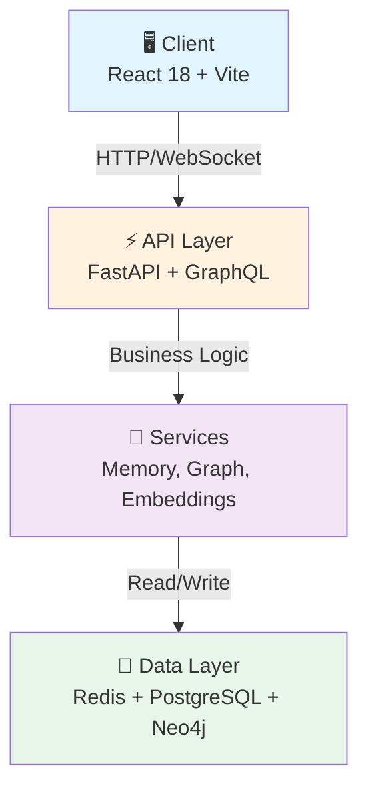

### Component Interaction Diagram

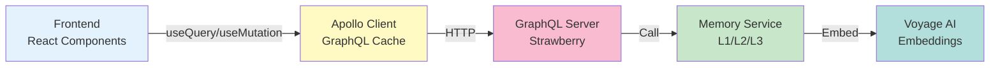

## Database Architecture

### Memory System (L1/L2/L3)

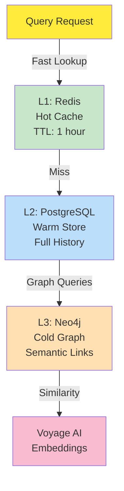

### Entity Relationship (Simplified)

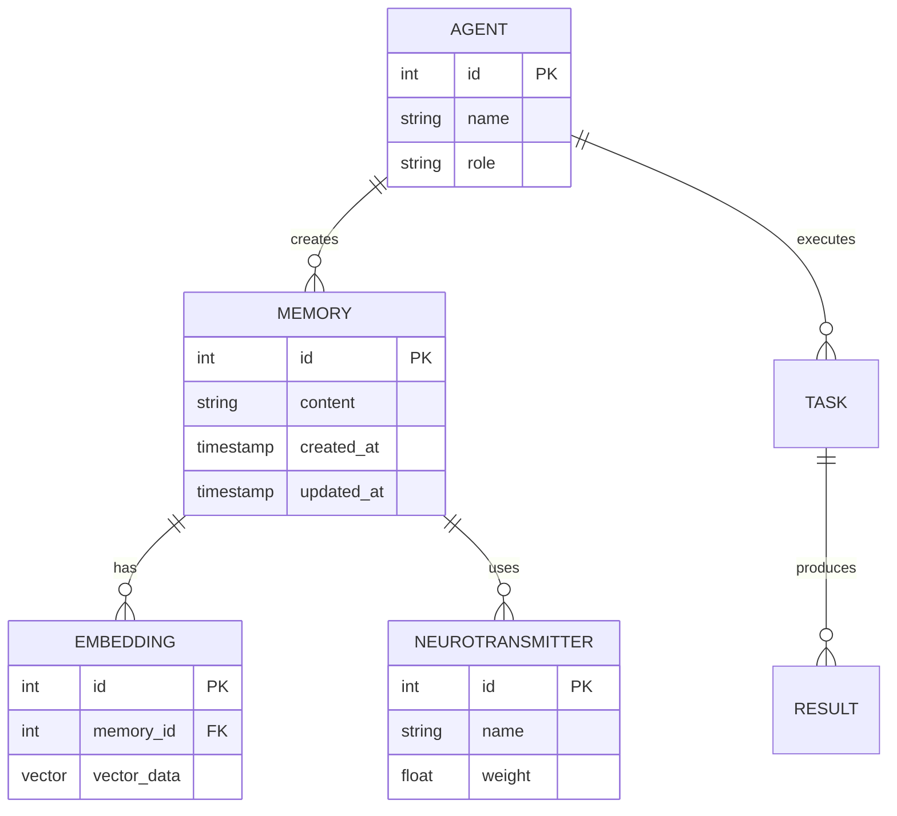

## Data Flow Architecture

### GraphQL Query Flow

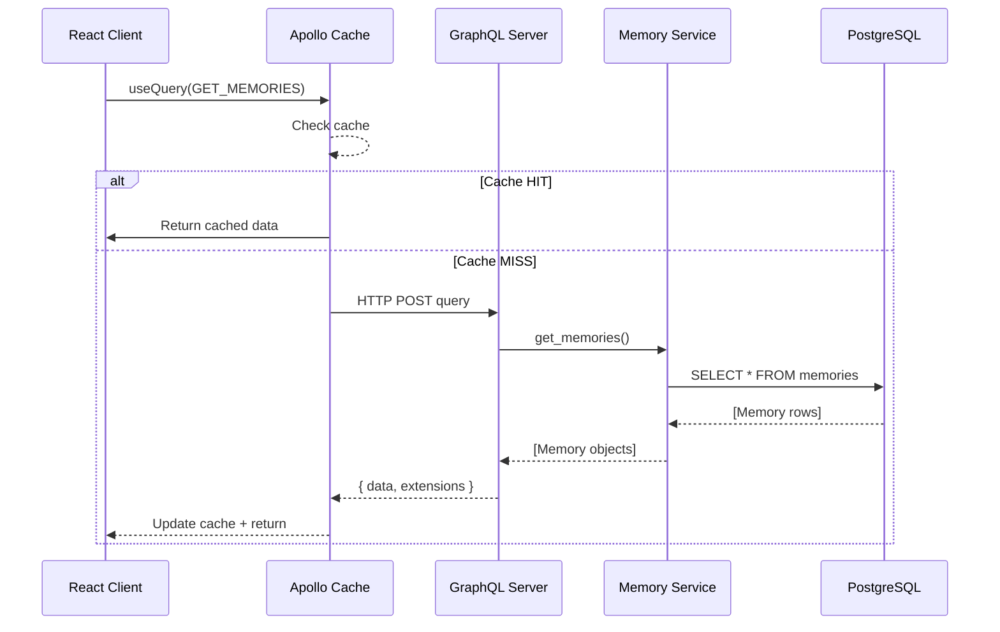

### Agent Execution Flow

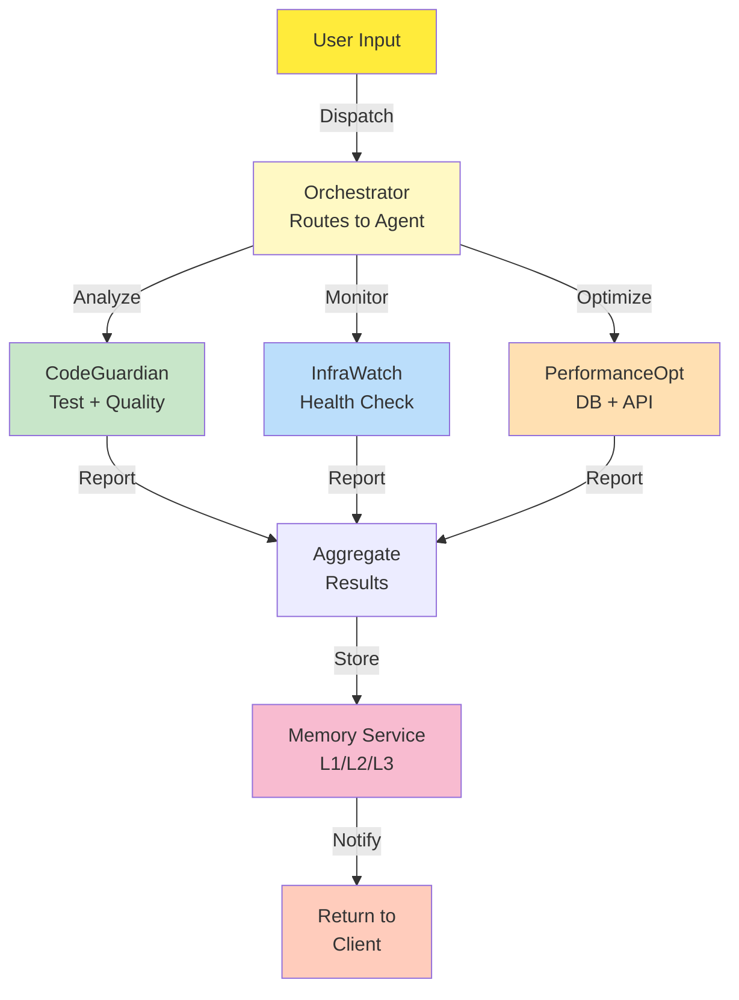

## Deployment Architecture

### Infrastructure Stack

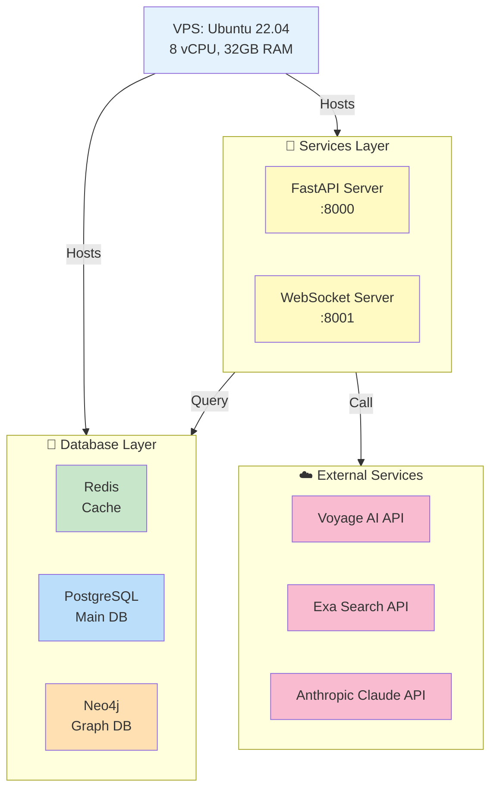

## State Machine Diagram

### Memory Consolidation State

```mermaid
stateDiagram-v2
    [*] --> Raw: New memory<br/>created

    Raw --> L1: Consolidate<br/>short-term
    L1 --> L2: After 1 hour<br/>or manual trigger
    L2 --> L3: After 7 days<br/>or search-heavy
    L3 --> Archived: After 90 days<br/>or low relevance

    L1 -.->|Cache Miss| L2
    L2 -.->|Graph Query| L3

    Archived --> [*]

    note right of Raw
        Direct input from
        hooks, API, agents
    end note

    note right of L1
        Hot cache
        Redis, TTL=1h
    end note

    note right of L2
        Warm store
        PostgreSQL
        Full history
    end note

    note right of L3
        Cold graph
        Neo4j
        Semantic links
    end note
```

## Styling Reference

### Color Palette (Accessibility-First)

| Component | Color | Hex | Use Case |
|-----------|-------|-----|----------|
| Frontend | Light Blue | #e3f2fd | Client-side |
| Backend API | Light Yellow | #fff9c4 | Server logic |
| Services | Light Purple | #f3e5f5 | Business logic |
| Cache | Light Green | #c8e6c9 | In-memory |
| Primary DB | Light Blue | #bbdefb | Main storage |
| Graph DB | Light Orange | #ffe0b2 | Relationships |
| External API | Light Pink | #f8bbd0 | Third-party |
| User/Input | Light Amber | #ffeb3b | User action |

### Styling Syntax

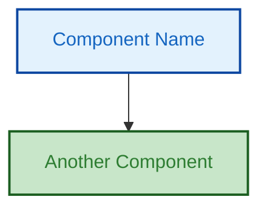

### Common Patterns

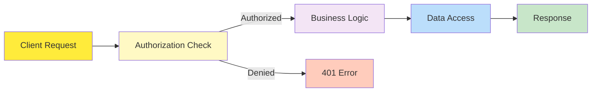

## Class Diagram (Backend Models)

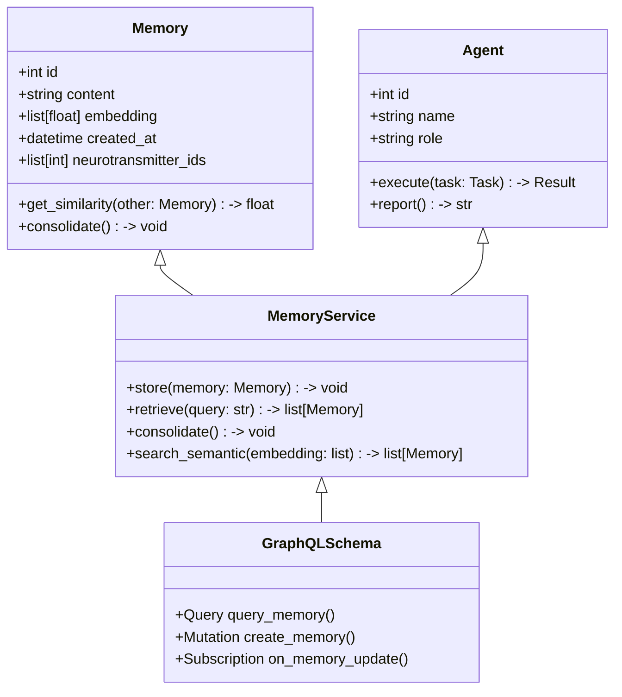

## Timeline (Feature Rollout)

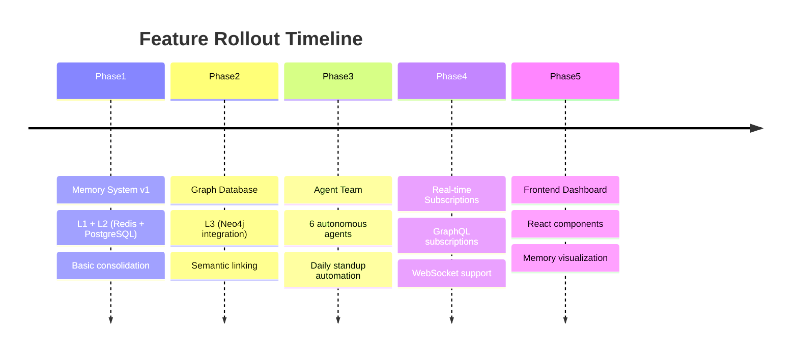

## Gitflow Diagram


## Mermaid Best Practices

### DO

✅ Use meaningful labels (not just "A", "B", "C")
✅ Keep arrows clear (single direction when possible)
✅ Color-code by layer/responsibility
✅ Add notes for context
✅ Test rendering in GitHub/docs platform
✅ Version in comments (top of diagram)

### DON'T

❌ Create diagrams > 15 nodes (split into multiple)
❌ Use colors that fail accessibility (WCAG AA)
❌ Cross same edge multiple times (hard to read)
❌ Mix different diagram types randomly
❌ Leave diagrams without title/legend

## Tools & Resources

```bash
# Mermaid editor (web)
https://mermaid.live

# Local rendering
npm install -g @mermaid-js/mermaid-cli
mmdc -i diagram.mmd -o diagram.svg

# GitHub Markdown (native support)
# Just paste mermaid block in .md

# Documentation
https://mermaid.js.org
```

---

**Version:** 2025-10-19 v1 - Mermaid Architecture Skill
**For:** DocsKeeper agent + architecture design
**Rendering:** GitHub + Mermaid Live Editor
