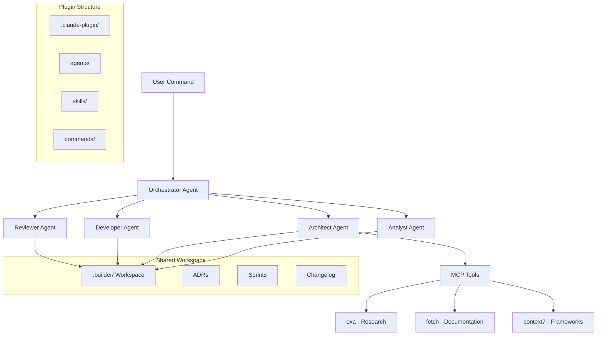
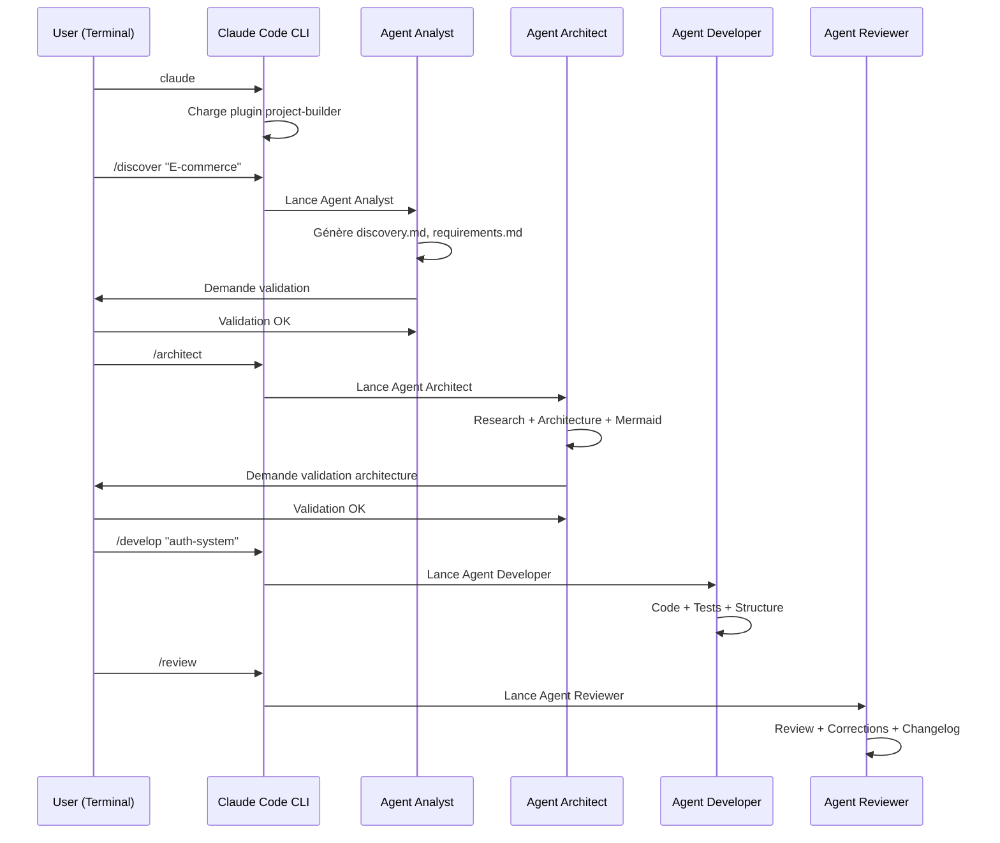

# Documentation Technique - Plugin "project-builder" Claude Code CLI

## 1. Vue d'ensemble du projet

Le plugin "project-builder" est un **plugin d'équipe** pour Claude Code CLI qui ajoute 5 agents spécialisés accessibles via des commandes slash. Il s'intègre nativement dans Claude Code CLI existant sans interface custom.

**Workflow simple :**
```bash
cd /mon-projet
claude                    # Démarre Claude Code CLI
/discover "E-commerce"    # Lance l'agent Analyst
/architect               # Lance l'agent Architect  
/develop                 # Lance l'agent Developer
/review                  # Lance l'agent Reviewer
```

**Objectif :** Ajouter une équipe d'agents spécialisés à Claude Code CLI pour projets long terme sur VPS.

## 2. Architecture du Plugin

### 2.1 Structure Générale



### 2.2 Installation et Configuration

**Installation du plugin :**
```bash
# Option 1: Plugin global
claude plugin install project-builder

# Option 2: Plugin local dans le projet
mkdir .claude-plugin
# Copier les fichiers du plugin dans .claude-plugin/
```

**Configuration automatique :**
- Claude Code CLI détecte automatiquement le plugin
- Les commandes slash deviennent disponibles
- Pas d'interface custom - utilise l'interface Claude Code existante

### 2.3 Composants du Plugin

| Composant | Quantité | Description |
|-----------|----------|-------------|
| **Agents spécialisés** | 5 | Analyst, Architect, Developer, Reviewer, Orchestrator |
| **Commandes slash** | 5 | /discover, /architect, /develop, /review, /deploy |
| **Skills intégrées** | 11 | Architecture research, Mermaid, ADR, structure stricte, etc. |
| **Serveurs MCP** | 3+ | exa (research), fetch (docs), context7 (frameworks) |
| **Workspace partagé** | 1 | .builder/ pour état et documentation évolutive |

## 3. Commandes Slash Disponibles

### 3.1 Workflow Claude Code CLI

```bash
cd /mon-projet
claude                           # Démarre Claude Code CLI

# Commandes du plugin project-builder :
/discover "E-commerce platform"  # Agent Analyst - Discovery & Requirements
/architect                       # Agent Architect - Architecture & Research  
/develop "user-auth"            # Agent Developer - Implémentation
/review                         # Agent Reviewer - Code review & Tests
/deploy                         # Agent Orchestrator - Déploiement
```

### 3.2 Séquence Typique



### 3.3 Validation Utilisateur Intégrée

**Points de validation dans Claude Code CLI :**
1. **Après /discover** - L'agent demande validation des requirements
2. **Après /architect** - L'agent demande validation de l'architecture
3. **Après /develop** - L'agent demande validation des fonctionnalités
4. **Avant /deploy** - L'agent demande validation finale

**Pas d'interface custom** - Tout se passe dans le terminal Claude Code CLI existant.

## 4. Spécifications des Agents

### 4.1 Orchestrator Agent

```yaml
name: orchestrator
description: Chef d'orchestre - Coordonne tous les agents et le workflow
model: claude-sonnet-4-5
tools: [read, glob, grep]
interdictions: [no_code_generation, no_direct_file_creation, coordination_only]
```

**Responsabilités :**
- Analyser les demandes utilisateur
- Router vers l'agent approprié
- Superviser l'exécution séquentielle
- Gérer les validations utilisateur
- Maintenir l'état du projet dans .builder/

### 4.2 Analyst Agent

```yaml
name: analyst
description: Discovery + PRD + Requirements
model: claude-sonnet-4-5
tools: [read, write, glob, exa, fetch]
interdictions: [no_code_generation, documentation_only]
```

**Livrables :**
- `.builder/01-discovery.md` - Vision, objectifs, personas
- `.builder/02-requirements.md` - PRD, user stories, MVP
- `.builder/03-wireframes.md` - Mockups conceptuels

### 4.3 Architect Agent

```yaml
name: architect
description: Research + Architecture système
model: claude-sonnet-4-5
tools: [read, write, glob, exa, fetch, context7]
skills: [architecture-research, mermaid-diagrams, system-design, adr-creation]
```

**Livrables :**
- `.builder/04-architecture.md` - Architecture système complète
- `.builder/05-decisions/` - ADR (Architecture Decision Records)
- Diagrammes Mermaid (C4, séquence, ERD)

### 4.4 Developer Agent

```yaml
name: developer
description: Code implementation avec structure stricte
model: claude-haiku-4
tools: [read, write, edit, glob, grep, bash]
skills: [strict-structure, code-reuse, naming-conventions, api-design]
```

**Structure imposée :**
```
project-root/
├── src/
│   ├── components/
│   │   ├── common/        # Réutilisables
│   │   └── pages/         # Spécifiques
│   ├── services/          # API calls
│   ├── utils/             # Fonctions utilitaires
│   ├── hooks/             # Custom hooks
│   ├── types/             # TypeScript types
│   └── assets/
├── tests/
├── docs/
└── .builder/              # Workspace évolutif
```

### 4.5 Reviewer Agent

```yaml
name: reviewer
description: Code review + Tests + Optimisations
model: claude-sonnet-4-5
tools: [read, edit, glob, grep, bash]
skills: [code-review, testing-strategy, performance-check]
```

**Process de review :**
1. Scan duplication et conventions
2. Vérification tests coverage (>80%)
3. Analyse performance et sécurité
4. Corrections automatiques
5. Mise à jour changelog

## 5. Skills Intégrées

### 5.1 Architecture Research

**Outils MCP utilisés :**
- **exa** : Recherche best practices 2025
- **fetch** : Documentation officielle
- **context7** : Guides frameworks
- **upstash** : Cache des recherches

**Process :**
1. Identifier technologie (React, FastAPI, PostgreSQL)
2. Research queries ciblées
3. Analyser trade-offs et comparaisons
4. Documenter findings structurés
5. Recommandations justifiées

### 5.2 Strict Structure

**Règles non-négociables :**
- Pas de fichiers à la racine src/ (sauf index)
- Components réutilisables dans common/
- 1 service par domaine métier
- Tests miroir de la structure src/

### 5.3 Code Reuse

**Validation avant création :**
```bash
# Scan existant
Glob: src/components/**/*.tsx
Grep: "function ComponentName"
# Si similarité >70% → réutiliser
```

### 5.4 Naming Conventions

| Type | Convention | Exemple |
|------|------------|---------|
| Fichiers | kebab-case | `user-profile.component.tsx` |
| Classes/Composants | PascalCase | `UserProfile` |
| Variables/fonctions | camelCase | `getUserData` |
| Constants | UPPER_SNAKE_CASE | `API_BASE_URL` |

## 6. Structure du Plugin Claude Code

### 6.1 Arborescence Complète

```
.claude-plugin/
├── plugin.json              # Configuration principale
├── agents/                  # 5 agents spécialisés
│   ├── analyst.md
│   ├── architect.md
│   ├── developer.md
│   ├── reviewer.md
│   └── orchestrator.md
├── commands/                # 5 commandes slash
│   ├── discover.js
│   ├── architect.js
│   ├── develop.js
│   ├── review.js
│   └── deploy.js
├── skills/                  # 11 compétences
│   ├── architecture-research.md
│   ├── mermaid-diagrams.md
│   ├── strict-structure.md
│   ├── code-reuse.md
│   ├── naming-conventions.md
│   ├── adr-creation.md
│   ├── testing-strategy.md
│   ├── performance-check.md
│   ├── security-scan.md
│   ├── documentation-gen.md
│   └── validation-flow.md
└── servers/                 # Configuration MCP
    └── mcp-config.json
```

### 6.2 Configuration plugin.json

```json
{
  "name": "project-builder",
  "version": "1.0.0",
  "description": "Équipe d'agents spécialisés pour projets long terme",
  "author": "Claude Code Team",
  "agents": [
    "agents/analyst.md",
    "agents/architect.md", 
    "agents/developer.md",
    "agents/reviewer.md",
    "agents/orchestrator.md"
  ],
  "commands": [
    "commands/discover.js",
    "commands/architect.js",
    "commands/develop.js", 
    "commands/review.js",
    "commands/deploy.js"
  ],
  "skills": [
    "skills/architecture-research.md",
    "skills/mermaid-diagrams.md",
    "skills/strict-structure.md",
    "skills/code-reuse.md",
    "skills/naming-conventions.md",
    "skills/adr-creation.md",
    "skills/testing-strategy.md",
    "skills/performance-check.md",
    "skills/security-scan.md",
    "skills/documentation-gen.md",
    "skills/validation-flow.md"
  ],
  "mcpServers": "servers/mcp-config.json"
}

**Output :**
```markdown
# Project Status

**Project:** E-commerce complet
**Phase:** Development Sprint 2
**Progress:** 60%

## Sprints
- Sprint 1: ✅ Completed (Auth)
- Sprint 2: 🔄 In Progress (Products)
- Sprint 3: ⏳ Planned (Cart)

## Metrics
- Tests coverage: 85%
- Files: 47
- LOC: 3,420
```

## 7. Workspace .builder/

### 7.1 Structure Documentation

```
.builder/
├── 01-discovery.md          # Vision, personas, objectifs
├── 02-requirements.md       # PRD, user stories, MVP
├── 03-wireframes.md         # Mockups conceptuels
├── 04-architecture.md       # Architecture système
├── 04-planning.md           # Sprints définis
├── 05-decisions/            # ADRs
│   ├── ADR-001-frontend.md
│   ├── ADR-002-database.md
│   └── ADR-003-auth.md
├── 06-sprints/              # Suivi sprints
│   ├── sprint-01.md
│   ├── sprint-02.md
│   └── sprint-XX.md
└── 07-changelog.md          # Historique changes
```

### 7.2 État Partagé

**Fonctionnalités :**
- **Persistance** entre sessions Claude Code
- **Synchronisation** entre agents
- **Évolution** documentation au fil du projet
- **Traçabilité** des décisions (ADRs)
- **Métriques** de progression

## 8. Configuration MCP

### 8.1 Serveurs Intégrés

```json
{
  "mcpServers": {
    "exa": {
      "command": "npx",
      "args": ["@exa-ai/exa-mcp-server"],
      "env": {
        "EXA_API_KEY": "${EXA_API_KEY}"
      }
    },
    "fetch": {
      "command": "npx",
      "args": ["@modelcontextprotocol/server-fetch"]
    },
    "context7": {
      "command": "npx", 
      "args": ["@context7/mcp-server"]
    }
  }
}
```

### 8.2 Mermaid Integration

**Diagrammes générés automatiquement :**
- **C4 Context** - Vue système global
- **C4 Container** - Composants internes
- **Sequence** - Flux critiques
- **ERD** - Modèle base de données
- **Flowchart** - Workflow métier

## 9. Déploiement VPS

### 9.1 Configuration Enterprise

```bash
# Installation sur VPS
curl -fsSL https://claude.ai/install.sh | sh
claude config set workspace /home/projects/
claude config set plugins-dir /home/plugins/

# Installation plugin
cd /home/plugins/
git clone project-builder-plugin
claude plugins install ./project-builder
```

### 9.2 Sessions Persistantes

**Avantages VPS :**
- **Sessions longues** - Projets multi-semaines
- **Accès multi-répertoires** - Workspace global
- **Ressources dédiées** - Pas de limitations locales
- **Collaboration équipe** - Accès partagé
- **Backup automatique** - .builder/ sauvegardé

## 10. Validation et Tests

### 10.1 Checklist Installation

- [ ] Créer structure `/home/pilote/projet/builder/`
- [ ] Configurer `.claude-plugin/plugin.json`
- [ ] Créer 5 agents avec frontmatter YAML
- [ ] Créer 11 skills documentées
- [ ] Créer 6 commands fonctionnelles
- [ ] Tester installation : `claude plugins list`
- [ ] Tester commande : `/project init "Test"`

### 10.2 Métriques Qualité

| Métrique | Seuil | Validation |
|----------|-------|------------|
| Tests coverage | >80% | Automatique |
| Code duplication | <5% | Reviewer agent |
| Performance | <2s load | Performance check |
| Sécurité | 0 vulnérabilités | Security scan |

## 11. Évolution et Maintenance

### 11.1 Versioning

**Stratégie :**
- **v1.0** - Core functionality (5 agents + 6 commands)
- **v1.1** - MCP servers integration
- **v1.2** - Advanced skills (performance, security)
- **v2.0** - Multi-project management

### 11.2 Extensibilité

**Points d'extension :**
- **Nouveaux agents** - Spécialisations métier
- **Skills additionnelles** - Technologies spécifiques
- **MCP servers** - Outils externes
- **Commands custom** - Workflows spécifiques

---

## Conclusion

Le plugin "project-builder" reproduit fidèlement les capacités de Trae SOLO Builder dans l'écosystème Claude Code CLI. Il offre :

✅ **Workflow séquentiel** avec validation utilisateur  
✅ **Agents spécialisés** avec contextes séparés  
✅ **Documentation évolutive** dans .builder/  
✅ **Architecture scalable** via MCP et skills  
✅ **Déploiement VPS** pour projets long terme  

Cette architecture permet de gérer des projets complexes de bout en bout avec la rigueur et la structure nécessaires au développement professionnel.